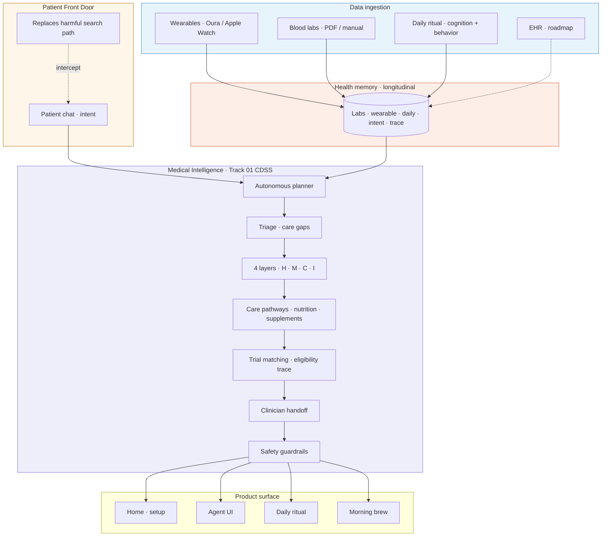
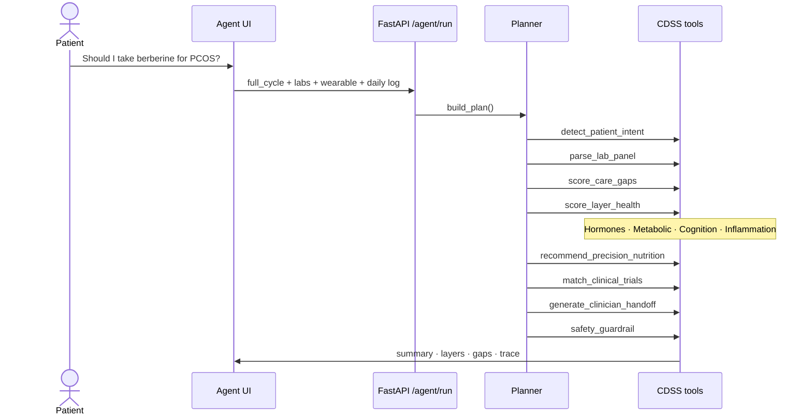

# Hsence

**Hormonal intelligence platform** · Patient Front Door + Medical Intelligence

**Nucleate NY BioHack · Track 01** — *Triage, diagnostics, care pathways, trial matching & multimodal patient data*

---

## What is Hsence?

**Hsence is a preventive medicine agent that uses hormones as a key biological signal** to track health and prevent chronic disease across a woman’s life course — PCOS, osteoporosis, gestational diabetes, and hormone-sensitive cancers.

Sync labs and wearable once. Hsence continuously fuses **wearable data, lab work, EHR-ready history, and daily behavior** to surface biomarker trends, care gaps, and evidence-graded plans — then closes the loop to your clinician with a **traceable CDSS agent**.

| Pillar | What it does |
|--------|----------------|
| **Patient Front Door** | Meets patients where beliefs form — Google, AI chatbots, social — *before* clinicians are involved. Detects intent, double-checks risky requests (e.g. *“Should I take berberine for PCOS?”*), routes weak evidence to standard care first. |
| **Medical Intelligence** | Track 01 CDSS: triage, 4-layer scoring (hormones · metabolic · cognition · inflammation), care pathways, trial matching, clinician handoff — with **full agent trace**. |

**Tagline:** Hormones as longitudinal biomarkers. Proactive care — not reactive guesswork.

> **Not a diagnosis engine.** Decision support and education only. Medications are always clinician-prescribed.

**Pitch deck:** [docs/PITCH_DECK.md](docs/PITCH_DECK.md) · **Full depth:** [docs/OVERVIEW.md](docs/OVERVIEW.md)

---

## Architecture

*Multimodal data flows up · personalised understanding and clinician-ready actions flow down.*



Export PNG for slides: paste the diagram into [mermaid.live](https://mermaid.live). Extended diagrams: **[docs/ARCHITECTURE.md](docs/ARCHITECTURE.md)**

---

## 2. Problem

### Hormonal health is systemic — care is fragmented

- The majority of women experience **hormonal shifts** that drive chronic conditions; many remain **undiagnosed for years** (e.g. PCOS: 8–10 years average to diagnosis).
- Once diagnosed, patients often feel **unsupported and confused** — “borderline” labs, no clear plan.
- **Hormones influence the whole body:** PCOS, **perimenopause**, osteoporosis, diabetes, hormone-sensitive **cancer survivorship** — not just reproduction.

### Patient Front Door — the upstream gap

Patients form healthcare beliefs where the **healthcare system does not show up** — search engines, AI chatbots, social communities, apps. What they find shapes decisions about **treatment, adherence, and self-management** before a clinician is involved — often **wrong, incomplete, or misaligned** with their condition.

**By the time they reach a clinician, the most consequential decisions have often already been made.**

*Example:* *“Should I take berberine for PCOS?”* — decided on Reddit, not in the clinic.

### Track 01 — the downstream gap

Clinical decision-making is **data-intensive and time-pressured**. Trial recruitment consumes up to **60%** of effort; eligibility criteria have surged **58%** over two decades. Clinicians need agents that fuse multimodal inputs with **traceable** triage and pathway support.

---

## 3. Solution — Hsence preventative medicine agent

Hsence focuses on **multimodal analysis**, **longitudinal memory**, and **hormones as biomarkers** to track health and help prevent — and manage — chronic disease.

| Capability | What Hsence does |
|------------|------------------|
| **Proactive vs reactive** | Continuous monitoring via wearables, labs, daily cognition — not one snapshot per year |
| **Multimodal fusion** | Labs + EHR-ready memory + wearable signals + daily behavior |
| **Longitudinal memory** | Parses medical history; patterns and care gaps persist visit to visit |
| **Biomarker intelligence** | LH:FSH, insulin, vitamin D, inflammation, sleep/HRV — tied to **hormone state** |
| **Personalized plan** | Evidence-graded **supplements** (★ strong / ◈ moderate), food rules, lifestyle |
| **Medications** | **Referred to doctor** — never self-prescribed |
| **Alerts & follow-up** | Care-gap triage, clinician handoff, trial match (demo) |
| **Front-door safety** | **Double-checks** health requests — e.g. *“Will this supplement normalize blood sugar?”* → labs + guidelines + standard care first |
| **Better adherence** | Daily ritual + morning brew — low friction, no shame |

### Condition modules

PCOS · perimenopause · gestational diabetes · osteoporosis · hormonal cancer survivorship — see **[docs/CONDITION_CASES.md](docs/CONDITION_CASES.md)**

---

## 4. Patient Front Door — experiment & impact

### Current efforts

We are designing an experiment to test whether an **AI-native approach** can better **detect patient intent** and **close the loop** with a frictionless path to resolution.

**Built in this repo:**

- `detect_patient_intent` — supplement risk, symptoms, trials, clinician prep
- Autonomous planner → full CDSS cycle from one chat message
- **Show why** · guideline snippets · **full agent trace**

### How this helps

| Outcome | Mechanism |
|---------|-----------|
| **Patient journey** — faster time to prescription | Surfaces standard-care gaps (e.g. metformin discussion) with lab evidence |
| **Higher first-time prior auth approval** | Structured GP summary + rationale (roadmap: PA packet) |
| **Faster time to approval** | Patient expectations aligned to guidelines before submission |
| **Share of voice** — citations in patient queries | Guideline snippets + evidence grades — citable medical intelligence |
| **Share of model rank** | Traceable tool chain replaces opaque chatbot answers |

Alignment detail: **[docs/TRACK01_ALIGNMENT.md](docs/TRACK01_ALIGNMENT.md)**

---

## 5. Agent flow & technical detail

### 5.1 CDSS agent flow (one patient question)



### 5.2 Four health layers

| Layer | Signals |
|-------|---------|
| **Hormones** | LH, FSH, testosterone, estradiol, cycle pattern |
| **Metabolic** | Glucose, insulin, HOMA-IR, lipids |
| **Cognition** | Sleep, HRV, mood, daily check-in |
| **Inflammation** | Recovery, food triggers, guideline context |

### 5.3 CDSS tool catalog

| Tool | Track 01 function |
|------|-------------------|
| `detect_patient_intent` | Patient Front Door — classify query |
| `parse_lab_panel` | Multimodal — lab normalization + pattern |
| `score_care_gaps` | **Triage** prioritization |
| `score_layer_health` | Diagnostic reasoning **support** (layers) |
| `retrieve_guideline_snippet` | Explainability |
| `recommend_precision_nutrition` | **Care pathways** |
| `match_clinical_trials` | Trial matching + eligibility rationale |
| `generate_clinician_handoff` | Loop closure |
| `safety_guardrail` | Not a diagnosis engine |

### 5.4 Tech stack (this repo)

| Layer | Implementation |
|-------|----------------|
| Frontend | `index.html` · `agent.html` · `daily.html` · `assets/site.css` |
| API | Python **FastAPI** — `agent/server.py` |
| Agent | Planner + tools — `agent/planner.py` · `agent/orchestrator.py` |
| Memory (demo) | `data/patient-memory.json` → roadmap PostgreSQL / FHIR |
| Deploy | `render.yaml` · one port — site + API |

---

## Run locally

```bash
git clone https://github.com/AlbinaKrasykova/Hsence-.git
cd Hsence-
bash scripts/start.sh
```

| URL | Page |
|-----|------|
| http://localhost:8080 | Home — setup, morning brew |
| http://localhost:8080/agent.html | **Precision agent (CDSS demo)** |
| http://localhost:8080/daily.html | Daily ritual |

### Quick demo

1. Open `agent.html`
2. Ask: *Should I take berberine for PCOS?*
3. **Run full CDSS cycle** → intent · layers · gaps · evidence · trials · handoff · trace

```bash
curl http://localhost:8080/agent/health
```

---

## Deploy

1. Push to GitHub (this repo)
2. [Render](https://render.com) → **Blueprint** → connect repo → `render.yaml`
3. Public URL serves UI + `POST /agent/run`

See **[docs/DEPLOY.md](docs/DEPLOY.md)**

---

## Documentation

| Doc | Contents |
|-----|----------|
| **[docs/OVERVIEW.md](docs/OVERVIEW.md)** | **Full in-depth expansion of every section** |
| [docs/PITCH.md](docs/PITCH.md) | Problem, solution, distribution |
| [docs/PITCH_DECK.md](docs/PITCH_DECK.md) | 6-slide deck copy |
| [docs/ARCHITECTURE.md](docs/ARCHITECTURE.md) | Mermaid diagrams + speaker script |
| [docs/TRACK01_ALIGNMENT.md](docs/TRACK01_ALIGNMENT.md) | Patient Front Door ↔ Track 01 mapping |
| [docs/CONDITION_CASES.md](docs/CONDITION_CASES.md) | PCOS · perimenopause · GDM · bone · cancer |
| [docs/DEMO.md](docs/DEMO.md) | Judge demo script |

---

## Safety

Hsence is **clinical decision support and patient education**. Supplements, medications, and trials require **clinician confirmation**. High-risk supplement queries route to **standard care first** with weak-evidence flags.

---

## License & contact

Hackathon / demo project.  
**Repository:** https://github.com/AlbinaKrasykova/Hsence-
