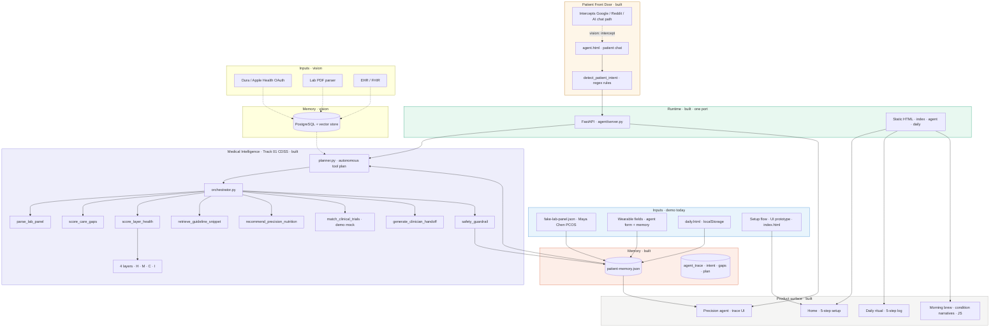
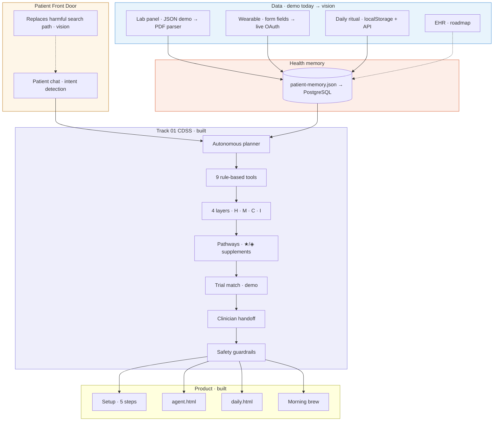
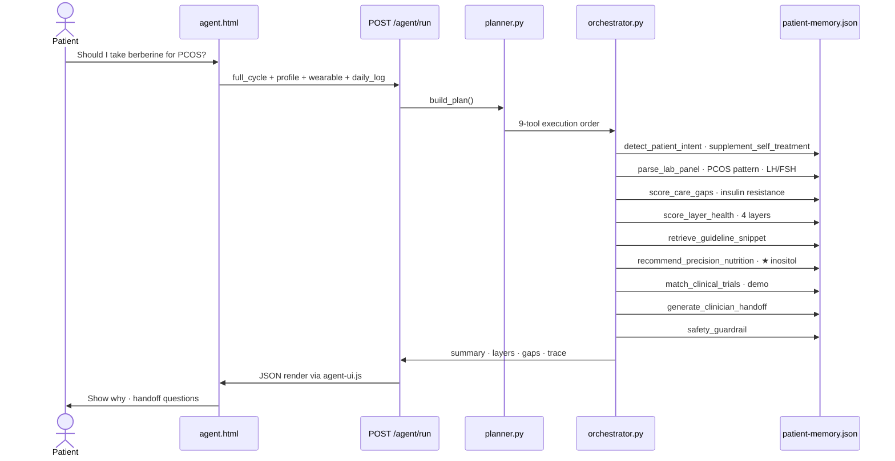

# Hsence — Architecture

**One-liner:** Multimodal data flows up · personalised understanding and clinician-ready actions flow down.

**Legend:** **Solid = built in this repo today** · *Dashed = solution vision / roadmap*

---

## Diagram 1 — As-built + vision (recommended for slides)

Copy into [mermaid.live](https://mermaid.live) → export PNG/SVG.



---

## Diagram 2 — Simplified stack (GitHub README)



---

## Diagram 3 — CDSS agent flow (one patient question)



---

## Built today vs solution vision

| Layer | Built now (this repo) | Vision |
|-------|-------------------------|--------|
| **Runtime** | FastAPI + static HTML on **one port** (`scripts/run_app.py`) | Render/Railway production deploy |
| **Patient Front Door** | Regex intent detection · berberine double-check · trace UI | LLM intent + citation layer · search intercept |
| **Labs** | `fake-lab-panel.json` · `parse_lab_panel` tool | PDF upload · NHS/Medichecks parser |
| **Wearable** | Demo fields in agent UI + memory | Oura / Apple Health live sync |
| **Daily log** | `daily.html` → `localStorage` + POST payload | Sync to server memory automatically |
| **Memory** | `patient-memory.json` (longitudinal trace) | PostgreSQL · FHIR Patient |
| **CDSS** | Planner + 9 **rule-based** tools (no API keys) | Optional LLM for narrative; tools stay traceable |
| **Trials** | Mock eligibility demo | ClinicalTrials.gov / registry APIs |
| **Setup** | 5-step **UI prototype** on home | Real onboarding + device OAuth |
| **Morning brew** | Condition-mode **JS narratives** | LLM narrative grounded in live signals |
| **Conditions** | PCOS primary demo · GDM · bone · cancer in tools/docs | Perimenopause card + expanded modules |

---

## Layer stack (accurate)

```
┌─────────────────────────────────────────────────────────────┐
│  PRODUCT SURFACE · built                                    │
│  index.html (setup + morning brew) · agent.html · daily.html│
└───────────────────────────┬─────────────────────────────────┘
                            ▼
┌─────────────────────────────────────────────────────────────┐
│  PATIENT FRONT DOOR · built                                 │
│  Chat → detect_patient_intent → safety-first routing        │
└───────────────────────────┬─────────────────────────────────┘
                            ▼
┌─────────────────────────────────────────────────────────────┐
│  CDSS AGENT · built                                         │
│  planner.py → orchestrator.py → 9 tools → guardrails.py     │
└───────────────────────────┬─────────────────────────────────┘
                            ▼
┌──────────────┬──────────────┬──────────────┬────────────────┐
│  HORMONES    │  METABOLIC   │  COGNITION   │  INFLAMMATION  │
│  score_layer_health · agent/layers.py + agent/tools/labs.py │
└──────────────┴──────────────┴──────────────┴────────────────┘
                            ▼
┌─────────────────────────────────────────────────────────────┐
│  CONDITION MODULES · built in tools + docs                  │
│  PCOS · perimenopause · GDM · osteoporosis · ER+ survivorship│
└───────────────────────────┬─────────────────────────────────┘
                            ▼
┌─────────────────────────────────────────────────────────────┐
│  HEALTH MEMORY · built → vision                             │
│  patient-memory.json (+ daily localStorage) → PostgreSQL    │
└───────────────────────────┬─────────────────────────────────┘
                            ▼
┌─────────────────────────────────────────────────────────────┐
│  DATA INPUTS · demo → vision                                │
│  fake-lab-panel.json · wearable fields → live APIs + EHR    │
└─────────────────────────────────────────────────────────────┘
```

---

## API surface (built)

| Endpoint | Method | Role |
|----------|--------|------|
| `/agent/health` | GET | Deploy health check |
| `/agent/memory` | GET | Load `patient-memory.json` |
| `/agent/run` | POST | Run CDSS cycle (`event_type`: `full_cycle`, `chat`, `daily_log`, …) |
| `/` · `/agent.html` · `/daily.html` | GET | Static site via `StaticFiles` |

---

## CDSS tool catalog

| Tool | File | Track 01 function |
|------|------|-------------------|
| `detect_patient_intent` | `agent/tools/intent.py` | Patient Front Door |
| `parse_lab_panel` | `agent/tools/labs.py` | Multimodal labs |
| `score_care_gaps` | `agent/tools/labs.py` | Triage |
| `score_layer_health` | `agent/tools/labs.py` | 4-layer support |
| `retrieve_guideline_snippet` | `agent/tools/guidelines.py` | Explainability |
| `recommend_precision_nutrition` | `agent/tools/nutrition.py` | Care pathways |
| `match_clinical_trials` | `agent/tools/trials.py` | Trial matching (demo) |
| `generate_clinician_handoff` | `agent/tools/clinician.py` | Loop closure |
| `safety_guardrail` | `agent/guardrails.py` | Not a diagnosis engine |

---

## Four health layers

| Layer | Signals (built) |
|-------|-----------------|
| **Hormones** | LH, FSH, testosterone, estradiol, cycle pattern |
| **Metabolic** | Glucose, insulin, HOMA-IR, lipids |
| **Cognition** | Sleep hours, HRV delta, mood, daily check-in |
| **Inflammation** | Recovery, food triggers, inflammation log |

---

## User journey → architecture mapping

| User step | Architecture touchpoint |
|-----------|-------------------------|
| **Setup 1–5** | UI prototype → vision: ingestion + memory |
| **Daily ritual** | `localStorage` + optional `POST /agent/run` (`daily_log`) |
| **Precision agent** | Full CDSS pipeline · `patient-memory.json` |
| **Morning brew** | Frontend condition narratives (not API yet) |

---

## Speaker script (~60 sec)

“Hsence runs as one FastAPI service — static site plus agent on port 8080. The Patient Front Door catches chat intent before harmful self-treatment. Demo data flows from a real-looking lab panel and wearable fields into longitudinal JSON memory. An autonomous planner runs nine traceable CDSS tools — not a black-box chatbot — scoring four health layers, triaging care gaps, and generating clinician handoff. The vision extends this with live Oura sync, PDF lab parsing, EHR, and PostgreSQL — but the architecture is already end-to-end in demo: setup story, daily ritual, agent trace, and morning brew narratives for PCOS through survivorship.”

---

## SVG diagrams (ready for slides)

| File | Contents |
|------|----------|
| [diagrams/hsence-architecture.svg](diagrams/hsence-architecture.svg) | Full stack · built + vision |
| [diagrams/hsence-agent-flow.svg](diagrams/hsence-agent-flow.svg) | 9-tool CDSS cycle |
| [diagrams/README.md](diagrams/README.md) | How to export and use |

Drag SVG into Google Slides / Canva, or preview in GitHub README.

---

## Link to pitch deck

Architecture slide: `docs/PITCH_DECK.md` · GitHub: `README.md` · Home page: `#architecture` on `index.html`
