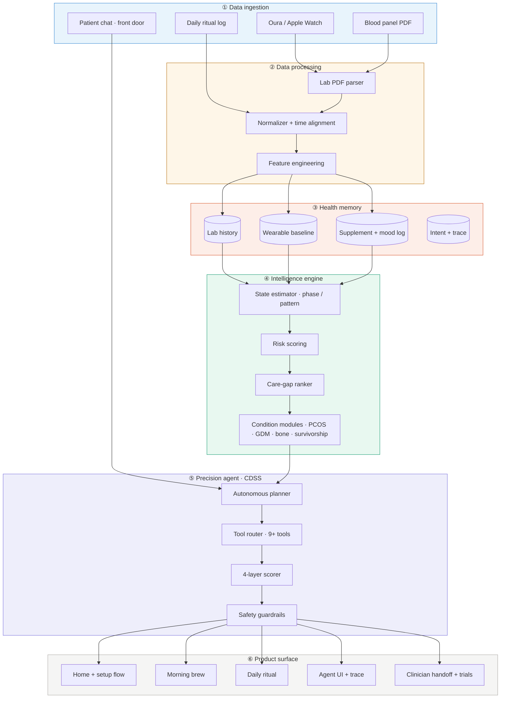
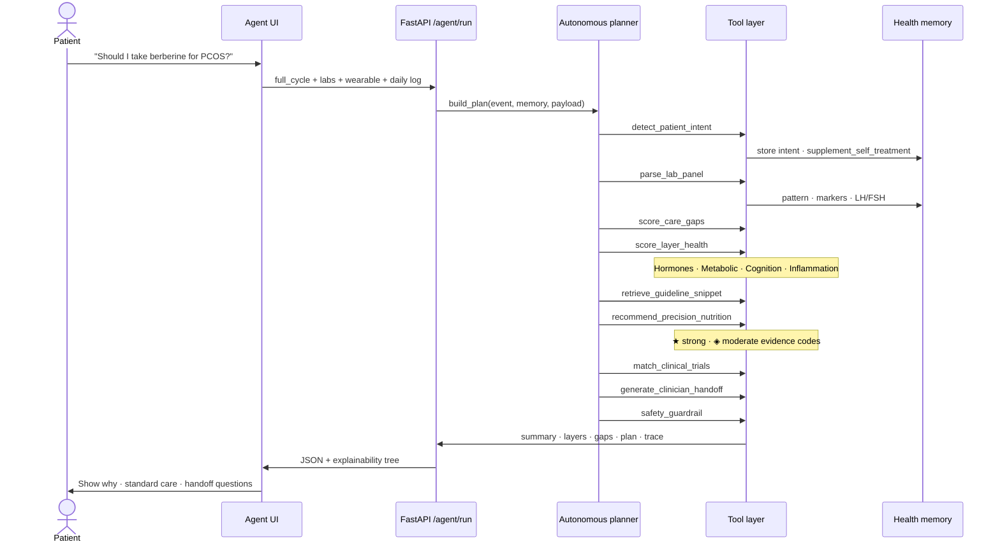

# Hsence — Architecture (for slides)

Use the diagrams below in Google Slides, Canva, or Mermaid Live Editor.  
**One-liner:** Multimodal data flows up; personalised understanding and clinician-ready actions flow down.

---

## Diagram 1 — System stack (slide: “Architecture”)

Copy into [mermaid.live](https://mermaid.live) → export PNG/SVG for slides.



**Demo today:** FastAPI + `patient-memory.json` (no Postgres required). Production path: PostgreSQL + vector store for longitudinal memory.

---

## Diagram 2 — CDSS agent flow (slide: “How the agent works”)



---

## Diagram 3 — Simple slide version (no Mermaid)

Paste as one slide — **“Hsence in one picture”**:

```
┌─────────────────────────────────────────────────────────────┐
│  PATIENT FRONT DOOR                                         │
│  Chat · labs · wearable · daily log                         │
└───────────────────────────┬─────────────────────────────────┘
                            ▼
┌─────────────────────────────────────────────────────────────┐
│  AUTONOMOUS PLANNER                                         │
│  Detect intent → select tools → fuse multimodal signals     │
└───────────────────────────┬─────────────────────────────────┘
                            ▼
┌──────────────┬──────────────┬──────────────┬────────────────┐
│  HORMONES    │  METABOLIC   │  COGNITION   │  INFLAMMATION  │
│  layer score │  layer score │  layer score │  layer score   │
└──────────────┴──────────────┴──────────────┴────────────────┘
                            ▼
┌─────────────────────────────────────────────────────────────┐
│  TRIAGE + RECOMMEND                                         │
│  Care gaps · standard care · nutrition · supplements ★/◈    │
│  Trial match · clinician questions · safety disclaimer      │
└───────────────────────────┬─────────────────────────────────┘
                            ▼
┌─────────────────────────────────────────────────────────────┐
│  OUTPUT                                                     │
│  Morning brew · daily ritual · agent trace · GP handoff      │
└─────────────────────────────────────────────────────────────┘
```

---

## Explain the solution (speaker script · ~90 sec)

**What Hsence is**  
Hsence is a hormonal intelligence platform with an autonomous clinical decision support agent. It is **not** a diagnosis engine. It helps patients understand their body between appointments and arrive at the next visit with better questions and evidence-graded options.

**The problem it solves**  
Women with PCOS, perimenopause, gestational diabetes, and related conditions often get “borderline” labs and fragmented advice. Hormones, metabolism, sleep, and mood are rarely read together. Hsence closes that gap with a **parallel care system** — calm UI, rigorous reasoning.

**How data enters**  
Users sync once: blood panel (PDF or manual), wearable (Oura / Apple Watch), and optional daily ritual (mood, food, supplements). A patient-front-door chat captures intent — e.g. *“Should I take berberine?”*

**What happens under the hood**  
1. **Planner** classifies intent and picks tools (no fixed script — autonomous CDSS).  
2. **Lab tools** normalize markers and infer patterns (e.g. PCOS androgen excess).  
3. **Four layers** are scored: hormones, metabolic, cognition, inflammation.  
4. **Care gaps** are ranked with evidence (insulin resistance, imaging follow-up, etc.).  
5. **Recommendations** include precision nutrition, supplements with ★/◈ grades, and weak-evidence routing for risky self-treatment asks.  
6. **Trials** (demo) match criterion-by-criterion; **clinician handoff** generates visit questions.  
7. **Guardrails** block diagnosis language and attach disclaimers.

**What the user sees**  
- **Home / setup** — onboarding story (wearable + labs).  
- **Agent** — full cycle with trace (every tool, every step).  
- **Daily ritual** — 60-second log, no streaks.  
- **Morning brew** — one narrative read, not a dashboard.

**Why this architecture wins**  
- **Multimodal fusion** — not single-biomarker charts.  
- **Explainability** — intent badge, guideline snippets, full trace.  
- **Condition modules** — PCOS, GDM, osteoporosis, survivorship on one stack.  
- **Deployable** — static UI + Python API on one port (Render/Railway).

**Safety**  
All outputs are decision support. Supplements and trials require clinician confirmation. Berberine-style queries route to standard care first when evidence is weak.

---

## Tool catalog (appendix slide)

| Tool | Role |
|------|------|
| `detect_patient_intent` | Classify front-door message |
| `parse_lab_panel` | Normalize labs + pattern |
| `score_care_gaps` | Rank gaps with evidence |
| `score_layer_health` | Four-layer scores |
| `retrieve_guideline_snippet` | Explainability |
| `recommend_precision_nutrition` | Meals, rules, supplements |
| `match_clinical_trials` | Eligibility demo |
| `generate_clinician_handoff` | GP questions + summary |
| `safety_guardrail` | Disclaimer + block diagnosis |

---

## Link to pitch deck

Slide 4 in `docs/PITCH_DECK.md` = shortened version of Diagram 2.  
Use **Diagram 1** for a dedicated architecture slide between Solution and Demo.
