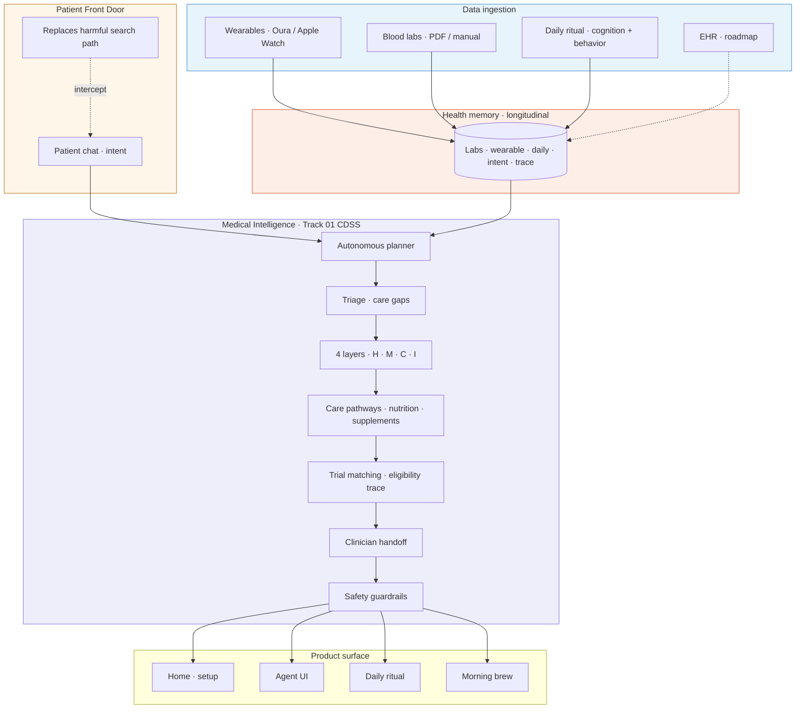
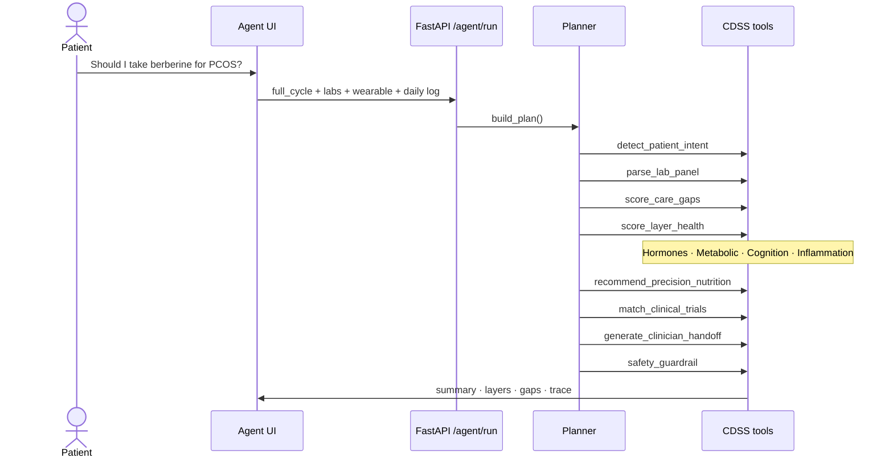

# Hsence — 6-slide pitch deck

Copy each block into Google Slides / Canva / Keynote.  
**Live demo:** `/agent.html` · **Repo:** https://github.com/AlbinaKrasykova/Hsence-

**Total time:** ~3 min pitch + 2 min live demo

**Architecture PNG:** paste Mermaid below into [mermaid.live](https://mermaid.live) → export SVG/PNG

---

## Slide 1 — Title & hook

**Hsence**  
*Hormonal intelligence platform*

**Patient Front Door** + **Medical Intelligence**

Nucleate NY BioHack · Track 01 · CDSS

> Hormones as longitudinal biomarkers.  
> Proactive care — not reactive guesswork.

**One line:** Sync labs and wearable once. Hsence explains your hormonal state, prevents chronic risk, and closes the loop to your clinician — with a traceable CDSS agent.

*Not a diagnosis engine.*

---

## Slide 2 — Problem

### Unified problem statement

**Hormonal imbalance is common, underdiagnosed, and linked to major chronic conditions in women:**

| Condition | Hormone link | Long-term risk |
|-----------|--------------|----------------|
| **PCOS** | Androgen excess + insulin resistance (LH, FSH, testosterone, insulin) | Irregular cycles, infertility, type 2 diabetes, endometrial cancer risk |
| **Osteoporosis** | Estrogen drop after menopause accelerates bone loss | Hip, spine, wrist fractures; higher risk in PCOS & cancer survivors |
| **Gestational diabetes** | Placental hormones block insulin → pregnancy insulin resistance | Preterm birth, large babies, lifelong type 2 diabetes risk (mother & child) |
| **Breast cancer (ER+)** | ~75–80% ER-positive; prolonged estrogen exposure fuels growth | Recurrence; bone loss on hormone-blocking therapy |

**Most women with hormone-related issues are confused, unsupported, and left without continuous care after diagnosis.**

- **8–10 years** average to PCOS diagnosis; years of “borderline” labs with no plan
- Sleep, mood, metabolism, and labs are rarely read **together**

### Patient Front Door — where harm starts

Patients form beliefs on **Google, Reddit, TikTok, and generic AI** — before any clinician is involved.

*“Should I take berberine for PCOS?”* · *“Does this supplement normalize blood sugar?”* — decided on forums, not in the exam room.

**By the time they reach a clinician, the most consequential decisions have often already been made.**

### Downstream — Track 01 gap

Clinicians face data overload; trial pre-screening consumes **~60%** of recruitment effort. Patients arrive with unstructured chaos.

---

## Slide 3 — Solution

### Unified solution statement

**Hsence is a preventive medicine agent that uses hormones as a key biological signal to track health and prevent chronic disease** across PCOS, osteoporosis, gestational diabetes, and hormone-sensitive cancers.

It continuously collects **wearable data, lab work, EHR-ready history, and daily behavior** to identify relevant biomarkers and trends — **proactive, not reactive.**

Based on a patient’s hormone state, it helps clinicians recommend:

- **Nature-based, clinician-guided wellness** — evidence-graded supplements (★ strong / ◈ moderate)
- **Medication plans** — prescribed or approved by a doctor only
- **Alerts, reminders, and follow-ups** — glucose screens, DEXA, mammograms, care-team touchpoints
- **Front-door double-check** — e.g. *“Does this supplement help normalize blood sugar?”* → aligned with labs, guidelines, and standard care first

| Condition module | How Hsence helps |
|------------------|------------------|
| **PCOS** | Tracks androgens, insulin, cycle patterns · flags metabolic risk early · supports metformin/BC adherence · reminds for GTT, lipids, BP |
| **Osteoporosis** | Estrogen + age + menopause status → bone risk trends · DEXA follow-up alerts · HRT/D3/calcium adherence · exercise & fall-risk nudges |
| **GDM** | Glucose, insulin, weight, pregnancy timeline · early insulin-resistance flags · monitoring & diet adherence · postpartum screen reminders |
| **ER+ breast cancer** | Contextualizes estrogen, HRT, family history · survivor bone health on blocking therapy · imaging & follow-up reminders · no diagnosis claims |

**Plus:** Patient Front Door intent detection · 4-layer scoring · care-gap triage · trial match · clinician handoff · full agent trace

---

## Slide 4 — Architecture *(current build)*

*Multimodal data flows up · personalised understanding and clinician-ready actions flow down.*

### System stack — paste into slides

### Four health layers

| Layer | Signals |
|-------|---------|
| **Hormones** | LH, FSH, testosterone, estradiol, cycle pattern |
| **Metabolic** | Glucose, insulin, HOMA-IR, lipids |
| **Cognition** | Sleep, HRV, mood, daily check-in |
| **Inflammation** | Recovery, food triggers, guideline context |

### CDSS tools (9) · built today

| Tool | Function |
|------|----------|
| `detect_patient_intent` | Patient Front Door — classify query |
| `parse_lab_panel` | Lab normalization + pattern |
| `score_care_gaps` | Triage prioritization |
| `score_layer_health` | 4-layer diagnostic support |
| `retrieve_guideline_snippet` | Explainability |
| `recommend_precision_nutrition` | Care pathways · ★/◈ supplements |
| `match_clinical_trials` | Trial matching + eligibility trace |
| `generate_clinician_handoff` | Loop closure |
| `safety_guardrail` | Not a diagnosis engine |

### Tech stack

| Layer | Implementation |
|-------|----------------|
| Frontend | `index.html` · `agent.html` · `daily.html` |
| API | Python **FastAPI** — `agent/server.py` |
| Agent | `agent/planner.py` · `agent/orchestrator.py` |
| Memory (demo) | `data/patient-memory.json` → PostgreSQL / FHIR |
| Deploy | `render.yaml` · one port — site + API · no API keys for demo |

**Extended diagrams:** `docs/ARCHITECTURE.md`

---

## Slide 5 — Demo moment *(live or screenshot)*

**Patient asks:** *“Should I take berberine for PCOS?”*

| Step | What Hsence does |
|------|------------------|
| 1 | **Detect intent** — supplement self-treatment (high risk) |
| 2 | **Fuse data** — LH:FSH, testosterone, HOMA-IR + Oura + daily log |
| 3 | **Score 4 layers** — hormones ↓ · metabolic ↓ · cognition · inflammation |
| 4 | **Triage gaps** — insulin resistance · androgen excess · vitamin D |
| 5 | **Pathway** — ★ myo-inositol · weak-evidence flag on berberine · standard care first |
| 6 | **Handoff** — *“Should we formally evaluate PCOS and discuss metformin?”* + full trace |

**Try live:** `bash scripts/start.sh` → **agent.html** → Run full CDSS cycle

*Show “Show why” — judges see the tool chain, not a black box.*

---

## Slide 6 — Ask & close

**We are building:** An AI-native Patient Front Door that meets patients where beliefs form — fused with Track 01 CDSS for explainable, clinician-ready care across PCOS, osteoporosis, GDM, and ER+ survivorship.

**Built today:** Intent detection · 9-tool agent · 4 condition modules · live demo on GitHub

**Want:** Hackathon feedback · clinical pilot partners · path to validation

**GitHub:** github.com/AlbinaKrasykova/Hsence-

> *“Hsence doesn’t replace your doctor. It makes hormones legible — so prevention, adherence, and the next appointment start with evidence.”*

**[your email]** · **[demo URL]**

---

## Speaker notes (~3 min)

### Slide 1 — 20 sec
“Hsence is a hormonal intelligence platform at the intersection of Pfizer’s Patient Front Door and Track 01 Medical Intelligence. We use hormones as longitudinal biomarkers — tracked over time, not one annual blood draw — to deliver proactive, explainable care.”

### Slide 2 — 45 sec
“Hormonal imbalance is widespread and under-recognized. In PCOS, androgen excess and insulin resistance drive menstrual disruption, metabolic disease, and endometrial risk. After menopause, low estrogen accelerates osteoporosis. In pregnancy, placental hormones cause insulin resistance that becomes gestational diabetes. And seventy-five to eighty percent of breast cancers are estrogen-receptor positive. Most women are confused and unsupported — diagnosed late, given borderline labs, and left without continuous care. Meanwhile they’ve already acted on forum advice before the appointment. That’s the gap.”

### Slide 3 — 40 sec
“Hsence is a preventive medicine agent using hormones as the core biological signal. We fuse wearables, labs, EHR-ready history, and daily behavior for proactive monitoring — not reactive guesswork. We recommend evidence-graded supplements, route all medications through clinicians, send smart follow-up alerts, and double-check front-door questions like whether a supplement will normalize blood sugar. Each condition module — PCOS, bone, GDM, ER-positive survivorship — has tailored biomarker tracking and adherence support.”

### Slide 4 — 35 sec
“Architecturally, the Patient Front Door intercepts chat intent. Labs, wearables, and daily ritual feed longitudinal memory. An autonomous planner runs nine CDSS tools — triage, four-layer scoring, pathways, trials, handoff, guardrails — and outputs to home, agent, daily ritual, and morning brew. Everything is traceable. The demo runs on FastAPI with no API keys.”

### Slide 5 — 40 sec *(or switch to live demo)*
“Maya, 34, asks: should I take berberine for PCOS? We detect high-risk supplement intent, fuse her labs and Oura data, surface insulin resistance as the top gap, flag berberine as weak evidence, recommend myo-inositol with strong PCOS evidence, and generate GP questions — with a full trace judges can audit.”

### Slide 6 — 20 sec
“We’re testing whether an AI-native front door plus CDSS can reduce harmful self-treatment and accelerate aligned care across the life course. We’d love feedback, pilot partners, and a path to validation. Thank you.”

---

## Appendix — expanded condition detail (backup slides / speaker depth)

Use if judges ask “how does this work for X?” — full text from problem research.

### PCOS
- **Hormone link:** High androgens disrupt ovulation; insulin resistance raises androgens further (LH, FSH, estrogen, progesterone, testosterone, insulin).
- **Risks:** Irregular/absent periods, infertility, T2D, obesity, hypertension, dyslipidemia, endometrial hyperplasia/cancer, bone metabolism issues.
- **Hsence:** Continuous androgen/insulin/cycle tracking · early metabolic flags · metformin/BC adherence · GTT, cholesterol, BP reminders · symptom-to-risk education.

### Osteoporosis
- **Hormone link:** Estrogen supports osteoblasts; post-menopause estrogen drop → porous bones, faster loss.
- **Risks:** Hip/spine/wrist fractures, mobility loss; elevated in PCOS and some cancer treatments.
- **Hsence:** Estrogen + age + menopause + bone history → risk trends · DEXA/lab follow-up flags · HRT/D3/calcium adherence · weight-bearing exercise & fall-risk alerts.

### Gestational diabetes
- **Hormone link:** Placental estrogen, cortisol, HPL block insulin → pregnancy insulin resistance; in some women → GDM.
- **Risks:** High blood sugar in pregnancy, preterm/large-baby complications, lifelong T2D risk for mother and child.
- **Hsence:** Glucose, insulin, weight, pregnancy timeline · early resistance detection · monitoring/diet/exercise adherence · glucose test & visit reminders.

### Breast cancer (ER+)
- **Hormone link:** 75–80% ER-positive; lifetime estrogen exposure increases risk; combined HRT can increase risk in some women.
- **Risks:** ER+ development, recurrence, osteoporosis on hormone-blocking therapy.
- **Hsence:** Estrogen, age, family history, HRT context · clinician-guided HRT/screening discussions · survivor bone & side-effect tracking · mammogram/imaging reminders · education without diagnosis claims.

---

## 5-min demo script (after pitch)

1. **Home** (`/`) — setup flow: wearable + lab upload · morning brew
2. **Agent** (`/agent.html`) — *“Should I take berberine for PCOS?”* → **Run full CDSS cycle**
3. Point at: intent → layers → gaps → ★/◈ supplements → trial criteria → handoff → trace
4. **Daily** (`/daily.html`) — log mood + food in &lt; 60 sec

See `docs/DEMO.md` for judge script.
