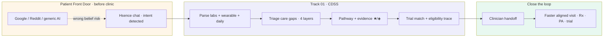

# Hsence ↔ Patient Front Door + Track 01 CDSS

How **Hsence** maps to the hackathon framing: **Patient Front Door** (where beliefs form before the clinic) and **Track 01 Clinical Decision Support** (multimodal reasoning, triage, pathways, trials).

---

## One slide — dual alignment

```
┌─────────────────────────────────────────────────────────────────┐
│  WHERE PATIENTS ACTUALLY ARE          WHERE CLINICIANS NEED THEM │
│  Search · AI chatbots · forums  →→→  CDSS · EHR · trials · Rx   │
│         PATIENT FRONT DOOR                    TRACK 01 CDSS       │
│              Hsence closes the loop between both                │
└─────────────────────────────────────────────────────────────────┘
```

**Hsence thesis:** Catch high-stakes patient intent *before* wrong self-treatment sticks — then fuse labs, wearable, and daily signals into **explainable CDSS** that triages gaps, recommends pathways, matches trials, and hands off to clinicians.

---

## Patient Front Door — gap & how Hsence responds

### The gap (their words → our patient)

| Hackathon framing | Hsence / real patient story |
|-------------------|----------------------------|
| Beliefs form on **search, AI chatbots, social, apps** — not in the health system | Maya googles *“berberine PCOS”* after her GP calls testosterone *“borderline”* |
| Decisions on **treatment, adherence, self-management** happen **before** a clinician | She may start supplements, skip metformin follow-up, or abandon care |
| Information is often **wrong, incomplete, misaligned** with actual condition | Forums promote berberine; weak n&lt;100 evidence; no read of her LH:FSH + insulin picture |
| **Most consequential decisions already made** at appointment | Visit becomes defensive — patient already “decided,” clinician lacks structured context |

### Current efforts (experiment)

> *AI-native approach to detect patient intent and close the loop with a frictionless path to resolution.*

**Hsence implementation:**

| Capability | What we built |
|------------|----------------|
| **Intent detection** | `detect_patient_intent` — supplement self-treatment, symptom seeking, trial interest, clinician prep, care-gap frustration |
| **Risk routing** | High-risk supplement queries → guideline + safety **before** nutrition recommendations |
| **Frictionless resolution path** | One chat → full CDSS cycle → layers, gaps, standard-care framing, ★/◈ evidence, handoff questions — not a dead-end chatbot answer |
| **Show why** | Intent badge, guideline snippets, **full agent trace** (model rank / citation analogue: traceable reasoning chain) |

**Demo utterance:** *“Should I take berberine for PCOS? My labs show high testosterone.”*

**Agent behavior:** Classifies `supplement_self_treatment` · does **not** endorse from search alone · routes to lab-informed conversation prep + clinician questions.

### How this helps (their metrics → our mechanism)

| Their outcome | How Hsence contributes (prototype → production path) |
|---------------|------------------------------------------------------|
| **Faster time to prescription** | Surfaces **standard-care gaps** (e.g. metformin discussion, HOMA-IR follow-up) with evidence — patient arrives ready for appropriate Rx conversation |
| **Higher first-time prior auth approval** | Structured **GP summary** + documented rationale from labs/layers (production: attach to prior-auth packet) |
| **Faster time to approval** | Reduces back-and-forth by pre-aligning patient expectations with guideline-backed options |
| **Increased citations in patient queries** | **Guideline snippets** + evidence codes in UI — designed to become citable, ranked medical intelligence (production: curated corpus + attribution) |
| **Increased share of model rank** | **Traceable tool chain** replaces opaque chat — each step auditable for trust and ranking in AI-mediated search |

---

## Track 01 — Clinical Decision Support alignment

### Hackathon scope

> Agents over **multimodal** inputs, EHR, labs, imaging, free text → **triage**, **diagnostic reasoning**, **care pathways** · **trial matching** with traceable eligibility.

### Hsence CDSS stack

| Track 01 requirement | Hsence feature | Demo evidence |
|---------------------|----------------|---------------|
| Multimodal patient data | Labs (`fake-lab-panel.json`) + wearable (sleep, HRV, readiness) + daily log (mood, food, inflammation) + chat | Agent sidebar + memory fusion |
| Triage prioritization | `score_care_gaps` — ranked gaps (insulin resistance, androgen excess, imaging, etc.) | Gap cards with severity + evidence |
| Diagnostic reasoning | `parse_lab_panel` + `score_layer_health` — pattern + 4 layers (not diagnosis label) | Pattern badge + layer scores |
| Care-pathway recommendations | `recommend_precision_nutrition` — meals, food rules, supplements, lifestyle | Care pathway panel with ★/◈ |
| Structured memory | `patient-memory.json` (demo) → PostgreSQL + vector store (roadmap) | Persistent profile, trace history |
| Explainable outputs | Guideline snippets + **8-step decision trace** | `trace-list` in agent UI |
| Trial matching | `match_clinical_trials` — criterion-by-criterion ✓/✗ | Trial cards in UI |
| Eligibility rationale | Per-criterion met/not met rows | Judge-visible explainability |
| Reduce clinician cognitive load | `generate_clinician_handoff` — questions + visit bullets | Doctor questions panel |
| Safety / not diagnosis | `safety_guardrail` + disclaimer | Footer disclaimer on every run |

### Publication parallels (talking points for judges)

| Paper theme | Hsence analogue |
|-------------|-----------------|
| **Nature Medicine** — multimodal oncology agent, 91% conclusions | Multimodal **endocrine-metabolic** agent; layers + labs + wearable; demo trace for conclusion audit |
| **IJSRSET** — EHR agent, triage precision, latency | Autonomous **planner** vs fixed rules; tool routing by intent; single API call full cycle |
| **TrialMatchAI** — hybrid retrieval + CoT eligibility | Mock trials with **criterion-by-criterion** reasoning (CoT-style eligibility rows) |
| **JCO scoping review** — interpretability + EHR gaps | **Full trace** + explicit gaps; roadmap: FHIR/EHR ingest |

---

## Combined patient journey (one narrative for slides)



**30-second pitch bridge:**  
*“Patients don’t form beliefs in the EHR — they form them in search and chat. Hsence is the Patient Front Door that catches intent before harm, then runs a Track 01 CDSS cycle on real multimodal data so the clinician encounter starts with triage, pathways, and trials already structured — not damage control.”*

---

## Slide copy — “Why both tracks, one product”

**Problem (shared):**  
Decisions happen upstream of the clinic, on bad information. Downstream, clinicians face data overload and recruitment bottlenecks.

**Solution (Hsence):**  
1. **Front door** — detect intent, block unsafe self-treatment paths, show why.  
2. **CDSS core** — multimodal fusion, gap triage, pathway + trial matching with trace.  
3. **Loop closure** — handoff artifacts that improve Rx, PA, and enrollment velocity.

**Not claiming:** Diagnosis, autonomous prescribing, or replacing oncologists/endocrinologists.

**Claiming:** AI-native **intent → resolution → handoff** experiment aligned with Pfizer Patient Front Door + Nucleate Track 01 CDSS.

---

## Demo script tied to rubric

| Step | Rubric hit | Action |
|------|------------|--------|
| 1 | Patient Front Door | Type berberine / supplement question |
| 2 | Intent detection | Show intent badge + high-risk routing |
| 3 | CDSS multimodal | Point to labs + wearable + daily inputs |
| 4 | Triage | Scroll care gaps (ranked) |
| 5 | Pathways | Supplements with ★/◈ + food rules |
| 6 | Trials | Expand criterion rows |
| 7 | Explainability | Open agent trace (tool order) |
| 8 | Close loop | Read “questions for your doctor” |

---

## Roadmap (honest — prototype vs production)

| Today (hackathon) | Production path |
|-------------------|-----------------|
| Rule + planner-based intent | LLM intent + guardrails |
| JSON memory | EHR / FHIR + PostgreSQL |
| Mock trials | TrialMatch-style retrieval |
| Static HTML UI | Patient app + clinician dashboard |
| No Rx integration | Prior-auth packet export · formulary-aware pathways |
